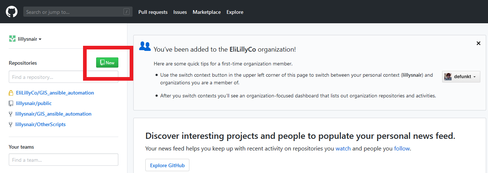

# Using Git

Git is a version control system often used for code, but can be used for any type of small file ( < 50 mb) storage.

Git is included by default on Linux, and the binaries to download for Windows and OSX [can be found here](https://git-scm.com/downloads).

Git definitions include the following:

- **Git Repository** (or just <u>repo</u>): The "folder" where all files are stored.
- **Commit**: Github works by updating files locally, then uploading changes to a central server. A commit saves local changes to your local git repo. You can commit multiple times before pushing to the central server.
- **Add**: adding is necessary to add the files you've changed to the local "change index" that you'll commit later. The shorthand `git add .` can be used to add all changed files to the index.
- **Pull**: The Pull command downloads changes from the central server that others have pushed. This should be done often to keep up ongoing changes to the central repo.
- **Push**: Pushing means taking the local commits and uploading them to the central server, where the master repo is stored.
- **origin & master**: Note that in push and pull, the terms origin and master are used. Origin is the Github repo, and master is the local repo. The command `git pull origin master` pulls information from the origin into the master, and `git push origin master` pushes changes from the master into the origin. Note that the names 'origin' and 'master' are standard, however they can be named anything.
- **Revert**: If you commit something you didn't mean to do, use `git revert HEAD^^` to roll back the previous commit. Note that this roll back itself is a commit and will show in the history. To not see the history, use `git reset --hard` . This is <u>permanent</u> however and should be done with care.
- **Branch**: A branch is where you'll commit your work in practice. *Origin* and *Master* are 2 specific branches, but on a team you should use many branches, such as "new features", "testing", and "bug fixes".

Download git: https://git-scm.com/downloads

## Initialize a Repo locally

When working with a personal repo (alone without a team), you can create a repo on github in the top left:


You can then initialize the git repo locally, add a README, make your first commit, and push that commit to github. The explanation of these terms are below:

```sh
git init
git remote add origin https://github.com/USER/REPO
git pull origin master

# make a file or move files into the directory you are working in

git add .
git commit -m "First commit"
git push origin master
```

Going through one by one:

1. `git init` initializes a repo locally.

2. `git remote add origin https://github.com/USER/REPO` allows the local repo to track the remote repo. Note that *origin* can be any name.

3. `git pull origin master` updates the local repo (master) by pulling any differences from the origin (online) repo. Since this is the first pull, everything is new, and therefore everything will be downloaded.

4. You can now do work; change, create, or delete files, and all files will be tracked every time you 'commit'.

4. `git add .` adds all tracked files (aka not explicitly ignored files) to the index, so on the next commit, these files will be committed. This should be done every time you are done working for a period of time.

5. `git commit -m "First commit"` commits all changed files, locking in any changes that were made. You are now ready to push your changes to the online repo so others can use and download the updates.

6. `git push origin master` pushes your commit(s) to the origin online, making your changes permanent and available to others.

Note: after the first time, future adding + committing can be done via `git commit -a -m "message"`

   ---

   For GNS in practice, you will never push directly to master. Instead, you work with branches that will eventually be merged into master, such as "newfeature" that you want to implement. An example is included below.
   

If you're ever confused or need information, `git status` is your friend.


# GNS Repo Structure

The following <u>Teams</u> and `Repos` are maintained under the [GNS team on Github](https://github.com/orgs/EliLillyCo/teams/gns):

- <u>DCN</u>
  - CB
  - JD
  - `GIS_ansible_automation`
- <u>LAN</u>
  - TZ
  - DB
- <u>WAN</u>
  - PJ
  - NG

## Links
https://guides.github.com/introduction/flow/
<br/>Matt Boren's guides: https://github.com/mtboren/GitLearning
<br/> Create a non-lilly repo: https://help.github.com/en/articles/create-a-repo
<br/>SSH and git access: https://help.github.com/en/articles/generating-a-new-ssh-key-and-adding-it-to-the-ssh-agent
<br/>Long for explanation of Step 5: Understanding the Workflow: https://gist.github.com/Chaser324/ce0505fbed06b947d962
<br/>Simple intro to git if you don't like this one: http://archaeogeek.github.io/foss4gukdontbeafraid/index.html
